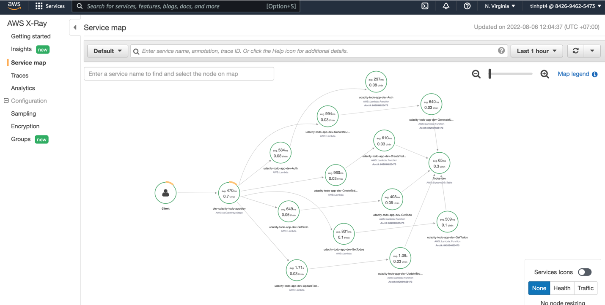
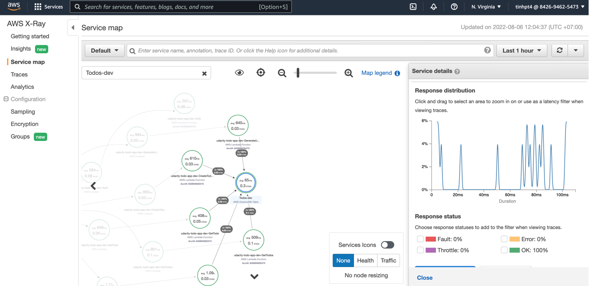

# Udacity - Cloud Developer Nanodegree Project 4

## Functionality of the application

The application allows creating/removing/updating/fetching TODO items. Each TODO item can optionally have an attachment image. Each user only has access to TODO items that he/she has created.

<div align="center">
  
</div>

***

## Implemented functions

The following lambda functions have been implemented (and set up in serverless.yml):
- Auth: Lambda authorizer (formerly custom authorizer)
- GetTodos: retrieves all todos for
- GetTodo: retrieves one todo (by id)
- CreateTodo: creates a new todo item
- UpdateTodo: updates a todo item
- DeleteTodo: removes a todo item
- GenerateUploadUrl: returns a signed url for uploading an image file to AWS S3

The JSON shape of a todo item
```
  {
    "todoId": "123",
    "createdAt": "2019-07-27T20:01:45.424Z",
    "name": "Buy milk",
    "dueDate": "2019-07-29T20:01:45.424Z",
    "done": false,
    "attachmentUrl": "http://example.com/image.png"
  }
```
All functions are already connected to appropriate events from API Gateway.
An id of a user can be extracted from a JWT token passed by a client.

Authentication is implemented with Auth0 (using asymmetrically encrypted JWT tokens).

***
## Frontend

The `client` folder contains a web application that can use the API that should be developed in the project. The apiId binding in `config.ts` should be set to the correct value.

This file configures your client application just as it was done in the course and contains an API endpoint and Auth0 configuration:

```ts
const apiId = '...' API Gateway id
export const apiEndpoint = `https://${apiId}.execute-api.us-east-1.amazonaws.com/dev`

export const authConfig = {
  domain: '...',    // Domain from Auth0
  clientId: '...',  // Client id from an Auth0 application
  callbackUrl: 'http://localhost:3000/callback'
}
```

***

# How to run the application

## Backend

To deploy an application run the following commands:
export NODE_OPTIONS=--max_old_space_size=8192

```
cd backend
npm install
sls deploy -v
```

## Frontend

To run a client application first edit the `client/src/config.ts` file to set correct parameters. And then run the following commands:

```
cd client
npm install
npm run start
```

This should start a development server with the React application that will interact with the serverless TODO application.

***

# Monitoring
## Distributed tracing

X-Ray tracing has been set up

<div align="center">
  
</div>

<div align="center">
  
</div>

## Logging

The starter code came with a configured [Winston](https://github.com/winstonjs/winston) logger that creates [JSON formatted](https://stackify.com/what-is-structured-logging-and-why-developers-need-it/) log statements. It is used to write log messages like this:

<div align="center">
  
</div>

```ts
import { createLogger } from '../../utils/logger'
const logger = createLogger('auth')

// You can provide additional information with every log statement
// This information can then be used to search for log statements in a log storage system
logger.info('User was authorized', {
  // Additional information stored with a log statement
  key: 'value'
})
```

<div align="center">
  
</div>

***

## Postman collection

An alternative way to test your API, you can use the Postman collection that contains sample requests. You can find a Postman collection in this project.

<div align="center">
  
</div>